# OGGY 🐱

 
 
 
 
 
 
 


## 📖 Mô tả / Description

**OGGY** là một game chạy nhảy (runner game) được phát triển bằng C# Windows Forms, lấy cảm hứng từ bộ phim hoạt hình "Oggy và những chú gián". Người chơi điều khiển nhân vật Oggy chạy và nhảy để thu thập xu trong khi tránh các vật cản nguy hiểm.

**OGGY** is a runner game developed with C# Windows Forms, inspired by the "Oggy and the Cockroaches" cartoon series. Players control Oggy to run and jump, collecting coins while avoiding dangerous obstacles.

## ✨ Tính năng / Features

- 🎮 Gameplay đơn giản, dễ chơi / Simple and intuitive gameplay
- 🪙 Thu thập xu để tăng điểm số / Collect coins to increase score
- ⚠️ Tránh các vật cản nguy hiểm (bom, thuốc nổ, rìu, bẫy chuột, v.v.) / Avoid dangerous obstacles (bombs, dynamite, hatchets, mousetraps, etc.)
- ⭐ Hệ thống mạng sống (3 mạng) / Life system (3 lives)
- 🎵 Nhạc nền và hiệu ứng âm thanh / Background music and sound effects
- 📊 Theo dõi điểm cao nhất / High score tracking
- ⏸️ Tạm dừng và tiếp tục game / Pause and resume functionality
- 🎨 Đồ họa đẹp mắt với animation mượt mà / Beautiful graphics with smooth animations

## 🖼️ Screenshots


## 📦 Tài nguyên game / Game Assets

Thư mục [`assets/`](https://github.com/TienNHM/OGGY/tree/main/assets) chứa tất cả các tài nguyên của game bao gồm:
The [`assets/`](https://github.com/TienNHM/OGGY/tree/main/assets) folder contains all game resources including:

### 🎬 Demo Video
- **[Xem Demo Video](assets/Demo.mp4)** / [Watch Demo Video](assets/Demo.mp4) - Video demo gameplay
- **[Tải Demo Video](assets/Demo.mp4)** / [Download Demo Video](assets/Demo.mp4)

### 🖼️ Hình ảnh / Images

#### 🐱 Nhân vật Oggy / Oggy Character
**[oggy/](https://github.com/TienNHM/OGGY/tree/main/assets/oggy)** - Sprites và animations của nhân vật Oggy / Oggy character sprites and animations

Ví dụ / Examples:

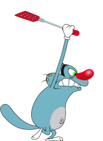 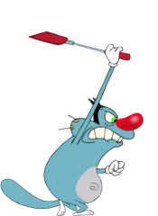 

#### 🪳 Nhân vật Gián / Cockroaches
**[cockroaches/](https://github.com/TienNHM/OGGY/tree/main/assets/cockroaches)** - Sprites của các chú gián / Cockroach sprites

Ví dụ / Examples:

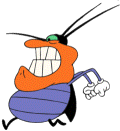 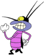 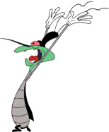

#### 🏠 Nền nhà bếp / Kitchen Background
**[kitchen/](https://github.com/TienNHM/OGGY/tree/main/assets/kitchen)** - Hình ảnh nền nhà bếp / Kitchen background images

Ví dụ / Examples:

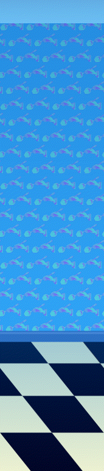

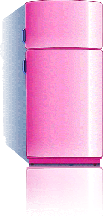 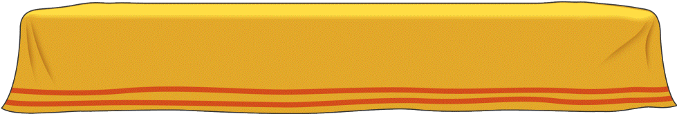

#### 🎮 Giao diện game / Game UI
**[game/](https://github.com/TienNHM/OGGY/tree/main/assets/game)** - UI elements và giao diện game / UI elements and game interface

Ví dụ / Examples:


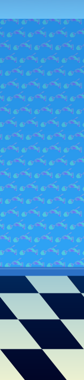 

#### ✨ Hiệu ứng / Visual Effects
**[fx/](https://github.com/TienNHM/OGGY/tree/main/assets/fx)** - Hiệu ứng hình ảnh / Visual effects

Ví dụ / Examples:

 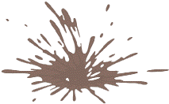 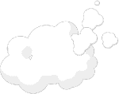

### 🎵 Âm thanh / Audio
- **[music/](https://github.com/TienNHM/OGGY/tree/main/assets/music)** - Nhạc nền và hiệu ứng âm thanh / Background music and sound effects
- Ví dụ / Examples:
  - [Background.wav](assets/music/Background.wav)
  - [Menu.mp3](assets/music/Menu.mp3)
  - [Jump.wav](assets/music/Jump.wav)

## 📋 Yêu cầu hệ thống / System Requirements

- **Hệ điều hành / OS**: Windows 7 trở lên / Windows 7 or later
- **.NET Framework**: 4.8 hoặc cao hơn / 4.8 or higher
- **RAM**: Tối thiểu 512 MB / Minimum 512 MB
- **Ổ cứng / Storage**: ~50 MB dung lượng trống / ~50 MB free space

## 🚀 Cài đặt / Installation

### Cách 1: Chạy từ source code / Method 1: Run from source code

1. **Clone repository:**
   ```bash
   git clone https://github.com/TienNHM/OGGY.git
   cd OGGY
   ```

2. **Mở project:**
   - Mở file `OGGY.sln` bằng Visual Studio 2017 trở lên
   - Open `OGGY.sln` with Visual Studio 2017 or later

3. **Restore packages:**
   - Visual Studio sẽ tự động restore NuGet packages
   - Visual Studio will automatically restore NuGet packages

4. **Build và chạy:**
   - Nhấn `F5` hoặc chọn `Debug > Start Debugging`
   - Press `F5` or select `Debug > Start Debugging`

### Cách 2: Chạy file đã build sẵn / Method 2: Run pre-built executable

1. Tải file release mới nhất từ [Releases](https://github.com/TienNHM/OGGY/releases)
   Download the latest release from [Releases](https://github.com/TienNHM/OGGY/releases)

2. Giải nén và chạy file `OGGY.exe`
   Extract and run `OGGY.exe`

## 🎮 Cách chơi / How to Play

### Điều khiển / Controls

- **↑ (Mũi tên lên)** hoặc **W**: Nhảy / Jump
- **Enter**: Tăng tốc độ vẽ (debug) / Increase draw speed (debug)
- **Pause/Play**: Tạm dừng hoặc tiếp tục game / Pause or resume game
- **Quit**: Thoát game / Exit game

### Mục tiêu / Objectives

- Chạy và nhảy để thu thập xu / Run and jump to collect coins
- Tránh các vật cản để không mất mạng / Avoid obstacles to not lose lives
- Đạt điểm số cao nhất có thể / Achieve the highest score possible
- Mỗi 5 điểm sẽ xuất hiện một vật cản ngẫu nhiên / Every 5 points, a random obstacle appears

### Luật chơi / Game Rules

- Bạn có 3 mạng sống (⭐) / You have 3 lives (⭐)
- Mỗi lần va chạm với vật cản sẽ mất 1 mạng / Each collision with an obstacle costs 1 life
- Khi hết mạng, game sẽ kết thúc / When all lives are lost, the game ends
- Điểm số được lưu và hiển thị điểm cao nhất / Score is saved and high score is displayed

## 📁 Cấu trúc dự án / Project Structure

```
OGGY/
├── Background/          # Lớp xử lý background
│   ├── Background.cs
│   └── Kitchen.cs
├── Characters/          # Các nhân vật trong game
│   ├── Character.cs
│   ├── Oggy.cs
│   ├── Gian.cs
│   ├── Coin.cs
│   ├── VaCham.cs       # Xử lý va chạm
│   └── VatCan.cs       # Các vật cản
├── UI/                 # Giao diện người dùng
│   ├── frmMenu.cs      # Màn hình menu chính
│   ├── frmMain.cs      # Màn hình game chính
│   └── EndGame.cs      # Màn hình kết thúc game
├── assets/             # Tài nguyên game
│   ├── oggy/           # Sprite của Oggy
│   ├── cockroaches/    # Sprite của gián
│   ├── kitchen/        # Hình ảnh nhà bếp
│   ├── game/           # UI elements
│   ├── fx/             # Hiệu ứng
│   └── music/          # Âm thanh và nhạc
├── Properties/         # Cấu hình project
├── Program.cs          # Entry point
└── OGGY.csproj         # Project file
```

## 🛠️ Công nghệ sử dụng / Technologies Used

- **.NET Framework 4.8** - Framework chính
- **C#** - Ngôn ngữ lập trình
- **Windows Forms** - GUI framework
- **GDI+** - Đồ họa 2D
- **System.Configuration** - Quản lý cấu hình
- **System.Media** - Phát âm thanh

## 🔧 Build từ source / Building from Source

1. Đảm bảo đã cài đặt Visual Studio 2017 trở lên với .NET Framework 4.8
   Ensure Visual Studio 2017 or later with .NET Framework 4.8 is installed

2. Mở `OGGY.sln` trong Visual Studio
   Open `OGGY.sln` in Visual Studio

3. Restore NuGet packages (tự động hoặc qua Package Manager Console)
   Restore NuGet packages (automatically or via Package Manager Console)

4. Build solution (Ctrl+Shift+B)
   Build solution (Ctrl+Shift+B)

5. Chạy project (F5)
   Run project (F5)

## 🐛 Báo lỗi / Reporting Bugs

Nếu bạn gặp lỗi, vui lòng tạo một [Issue](https://github.com/TienNHM/OGGY/issues) với:
If you encounter bugs, please create an [Issue](https://github.com/TienNHM/OGGY/issues) with:

- Mô tả chi tiết về lỗi / Detailed description of the bug
- Các bước để tái hiện lỗi / Steps to reproduce
- Hình ảnh hoặc video (nếu có) / Screenshots or videos (if available)
- Thông tin hệ thống / System information

## 🤝 Đóng góp / Contributing

Đóng góp luôn được chào đón! Vui lòng:
Contributions are welcome! Please:

1. Fork repository
2. Tạo branch mới cho tính năng của bạn (`git checkout -b feature/AmazingFeature`)
   Create a new branch for your feature (`git checkout -b feature/AmazingFeature`)
3. Commit các thay đổi (`git commit -m 'Add some AmazingFeature'`)
   Commit your changes (`git commit -m 'Add some AmazingFeature'`)
4. Push lên branch (`git push origin feature/AmazingFeature`)
   Push to the branch (`git push origin feature/AmazingFeature`)
5. Mở Pull Request
   Open a Pull Request

## 📝 License

Dự án này có thể được phân phối dưới giấy phép riêng. Vui lòng kiểm tra file LICENSE (nếu có) để biết thêm chi tiết.
This project may be distributed under its own license. Please check the LICENSE file (if available) for more details.

## 👤 Tác giả / Author

**TienNHM**

- GitHub: [@TienNHM](https://github.com/TienNHM)
- Facebook: [Nguyễn Huỳnh Minh Tiến](https://www.facebook.com/tiennhm.vn)

## 🙏 Lời cảm ơn / Acknowledgments

- Dựa trên bộ phim hoạt hình "Oggy và những chú gián" / Based on the "Oggy and the Cockroaches" cartoon series
- Cảm ơn tất cả những người đã đóng góp cho dự án / Thanks to all contributors

---

⭐ Nếu bạn thích dự án này, hãy cho một star! / If you like this project, please give it a star!
